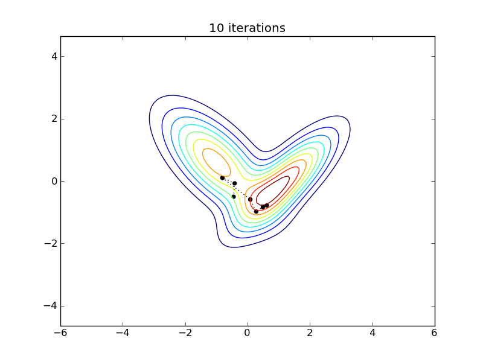
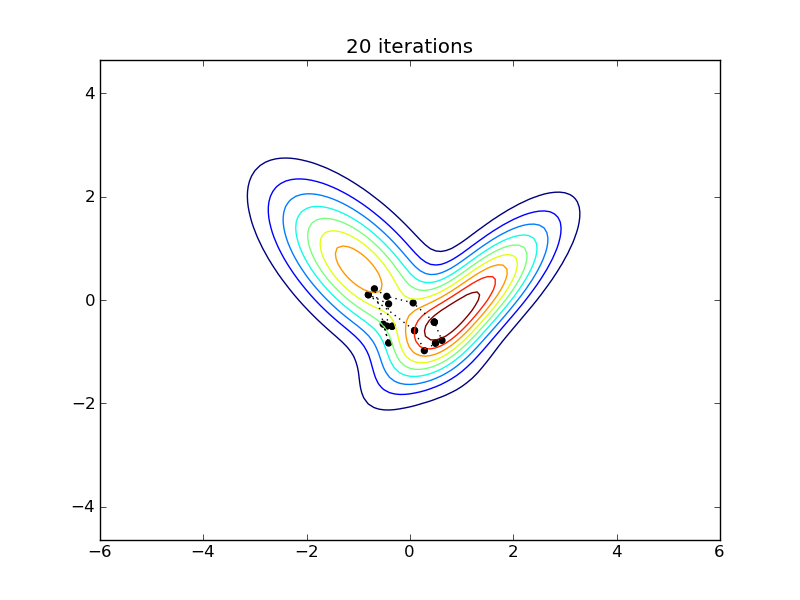
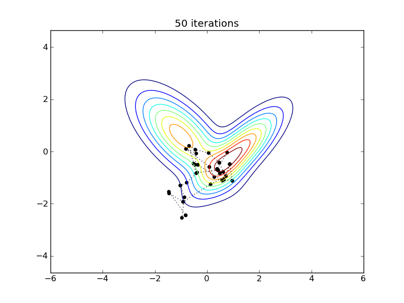
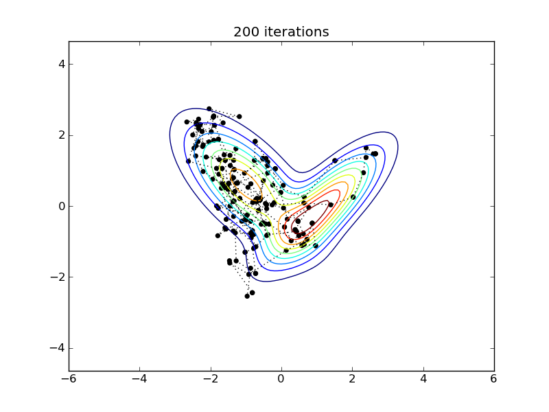
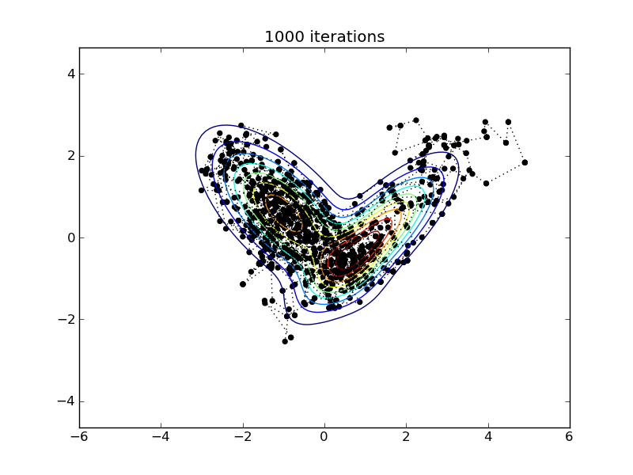
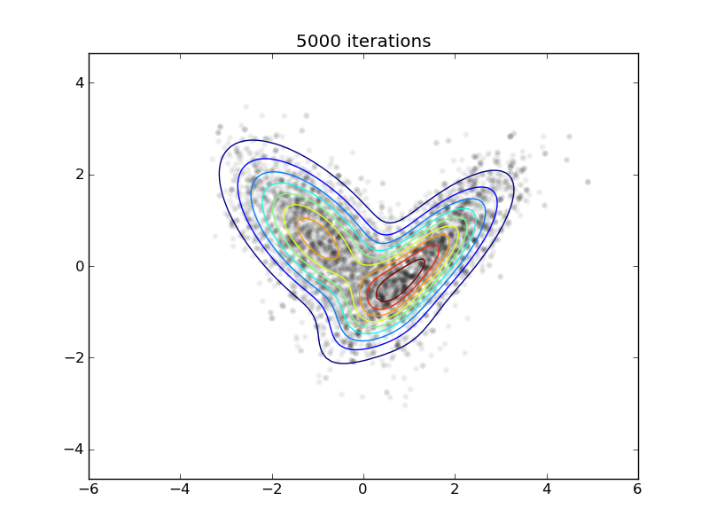

# Metropolis Sampling Made Easy

## Introduction
Metropolis sampling is one of a family of inference methods, collectively known as Markov chain Monte Carlo (**MCMC**) [foot: MCMC methods are themselves part of the larger family of "Monte Carlo" inference methods, distinguished by their reliance on random exploration of a space of hypotheses].  In its most fundamental form, Metropolis sampling is very simple - it can be implemented in just a few lines of code. But the basic recipe can be used as a building block in very sophisticated and powerful inference schemes.

MCMC is one of the fundamental approaches to sampling. In general, it can be very hard to draw random samples from complex, high-dimensional probability distributions. MCMC methods get around this by taking a random walk through the space defined by the parameters of the distribution in question. Through the miracle of **detailed balance**, they guarantee that - if run long enough - they will explore the space in proportion to its probability density.

## Implementing the sampler
A Metropolis sampler works as follows:

1. Starting wherever you are in parameter space, evaluate the target distribution at that location
2. Propose a new location to jump to next, and evaluate the probability distribution at that new location
3. If the new probability is greater than the current one, accept the proposal and update the current location
4. If the new probability is less than the current one, accept the proposal with probability equal to the ratio of the new probability to the old one; otherwise reject and stay put
5. Goto 1

In pythonic pseudocode, this looks like this:

In general, the target distribution is going to be a function of both the parameters and the observed data - possibly a very complicated function. All of these details can matter quite a bit when you're trying to improve the performance of your sampler (by coming up with better proposals, for example), but for now we'll keep things simple.

FIXME The meaning of the target distribution
FIXME The meaning of the proposal distribution

## Running the sampler and looking at the output
We'll start the sampler at (0, 0) and run it for 10 steps:

In this picture and those that follow, each dot represents the location of the parameters at the end of each step. The dashed lines connect subsequent steps, so that you can get a sense for how the sampler is moving around in parameter space from one step to the next. Note that there are fewer dots than steps, because the location does not change on those steps where the proposal is rejected.

Now, as we add more and more steps, we see that the collection starts to approximate the target distribution:

In the following figures, I've changed the plotting so that each step is shown by a translucent dot, and the connecting lines are omitted for clarity. This kind of plot gives a more direct sense of the spatial density of the samples - higher-probabilty regions are darker - and it becomes increasingly obvious that the sampler is providing a better and better approximation of the target distribution:

Protip: The alpha channel is a very useful tool for showing the density of samples.

I've also made a video of the sampler in action, which might give a better sense of the dynamics of the process. For the first 30 seconds, individual steps are shown; then, toward the end, 10 steps are added at a time. At the end of the video, several thousand steps have been plotted (and the output gets pretty messy...)

<iframe width="480" height="360" src="http://www.youtube.com/embed/4I6TaYo9j_Y?rel=0" frameborder="0" allowfullscreen></iframe>

## Getting independent samples

## Next steps: generalizations and extensions

In some sense, we've only scratched the surface of Metropolis sampling, but I don't think that's the best way of looking at it.  In fact, most or all of the elements of samplers are present even in our simple example - the proposal distribution, the target distribution, and the parameters over which inference is performed. Each of these elements can become significantly more complex, but their relationship to one another, and the overall structure of the sampler, remains the same.

That said, here are a few of the ways in which samplers typically become more complex or sophisticated as our demands on them increase - as we try to solve harder and harder problems:

1. The target distribution can become much more complex. In particular, the number of parameters can increase dramatically, meaning that we need to explore a very high-dimensional space. This typically leads to…
2. The proposal distribution becoming more sophisticated. There can be different proposals for different parameters, or the proposals can incorporate more knowledge about the target distribution in order to explore it more efficiently (i.e., cover more "ground" in fewer steps while maintaining a decent acceptance ratio).
3. Choosing a good initial state can become a project unto itself. In high-dimensional situations, the "peaks" of the target distribution can be very hard to find, and using a naive starting point might require many steps to find these regions.
4. Real-world samplers often include several inference techniques in concert. Part of the art of probabilistic inference programming is learning how to use the many available tools strike the right tradeoff between implementation effort and computational efficiency, and learning to mix and match as needed. Metropolis sampling is one of these basic tools, but there are some other important ones as well.

## References and Resources
- The [original Metropolis sampling paper](http://home.gwu.edu/~stroud/classics/Metropolis53.pdf) - checking out the author list!